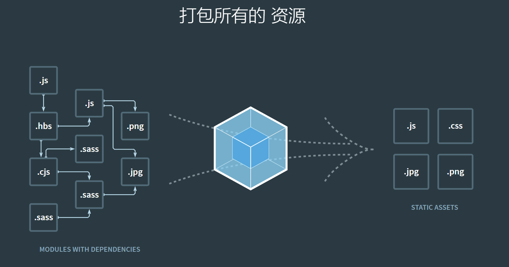
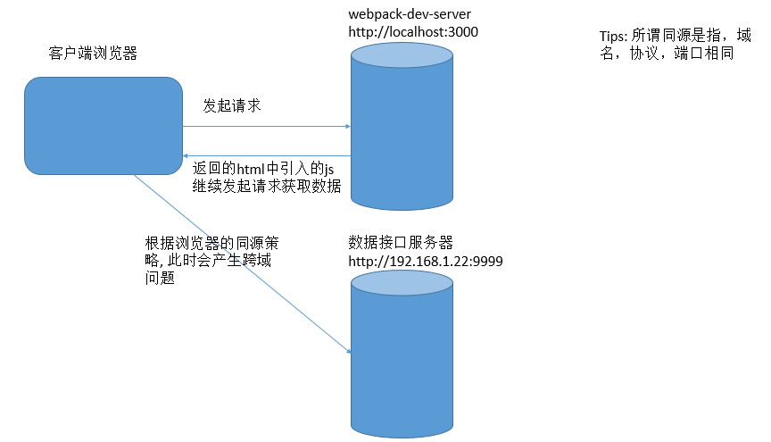
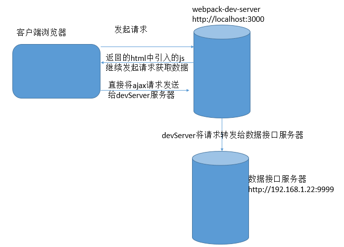
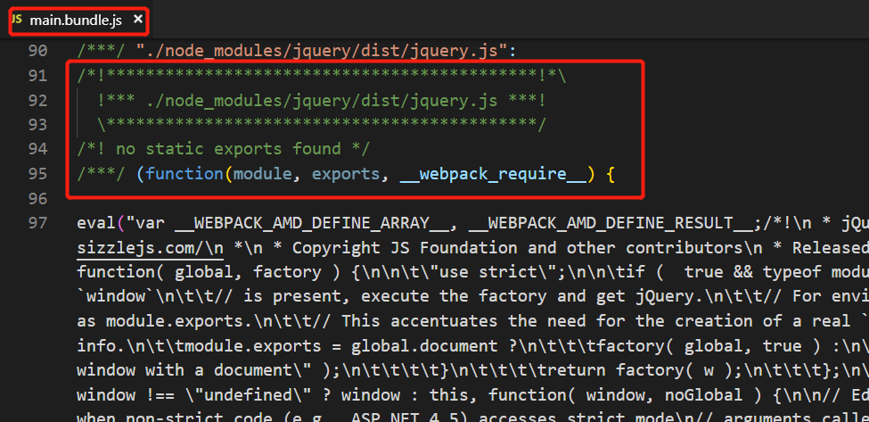
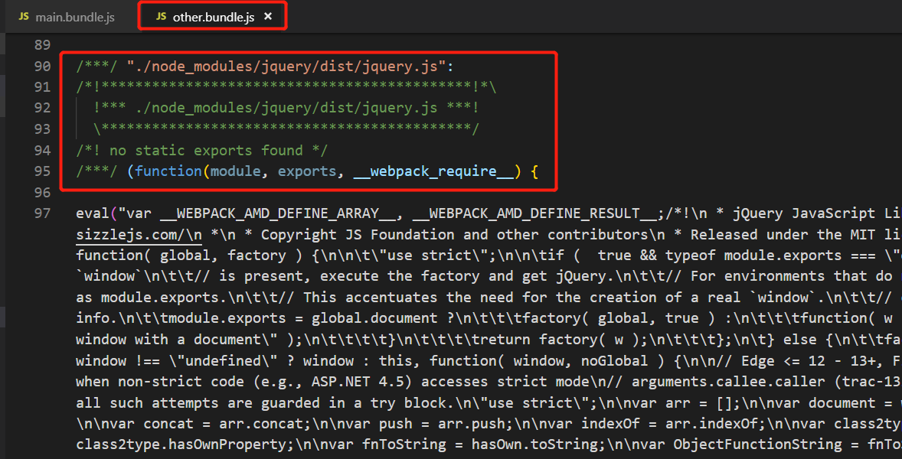
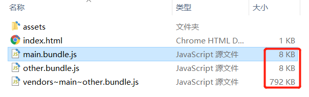
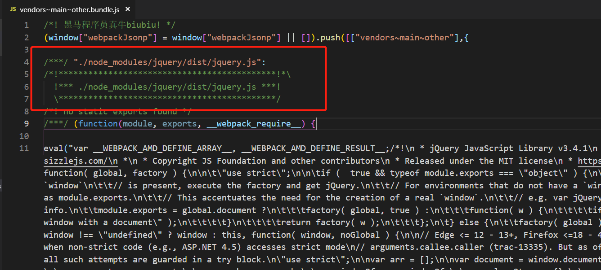
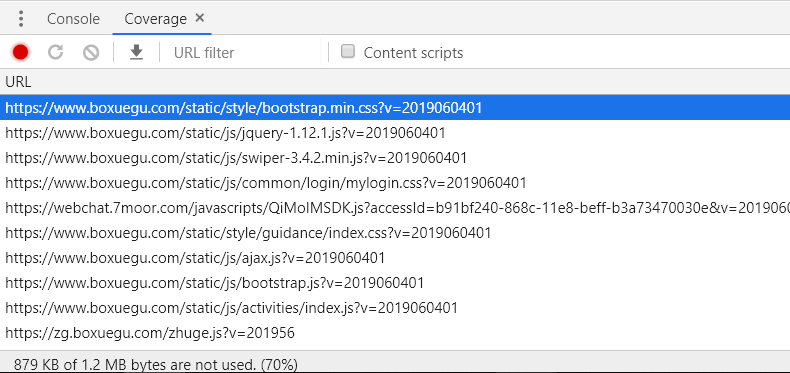
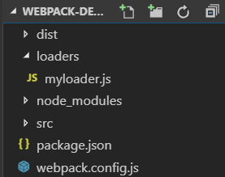
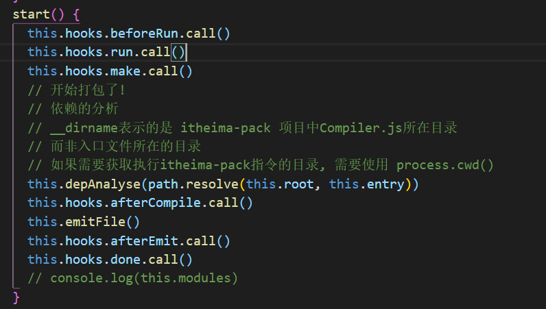

# webpack从入门到进阶

# 第1章 课程介绍

## 学什么

- [webpack官网](https://www.webpackjs.com)

> 本质上，*webpack* 是一个现代 JavaScript 应用程序的*静态模块打包器(module bundler)*。当 webpack 处理应用程序时，它会递归地构建一个*依赖关系图(dependency graph)*，其中包含应用程序需要的每个模块，然后将所有这些模块打包成一个或多个 *bundle*。



- 代码转译
- 模块合并
- 混淆压缩
- 代码分割
- 自动刷新
- 代码校验
- 自动部署

## 课程安排

- webpack基础配置
- webpack高级配置
- webpack性能优化
- tapable钩子
- AST抽象语法树的应用
- webpack原理分析, 手写webpack
- 手写常见的loader和plugin

## 学习前提

- JS基础
- ES6 / ES7 语法
- node基础
- npm的基本使用

## 课程目标

- 掌握webpack的安装
- 掌握webpack的基础配置
- 掌握loader的配置
- 掌握plugin的配置
- 了解webpack性能优化
- 了解webpack中的tapable
- 了解AST的应用
- 深入学习webpack原理，手写webpack

# 第2章 webpack基础

## webpack的安装

注意：请先自行安装[nodejs](https://nodejs.org)最新版的环境

- 全局安装webpack

  `npm i webpack webpack-cli -g`

- 项目中安装webpack (推荐)

  `npm i webpack webpack-cli -D`

## webpack的使用

### webpack-cli

npm 5.2 以上的版本中提供了一个`npx`命令

npx 想要解决的主要问题，就是调用项目内部安装的模块，原理就是在`node_modules`下的`.bin` 目录中找到对应的命令执行

使用webpack命令：`npx webpack`

webpack4.0之后可以实现0配置打包构建，0配置的特点就是限制较多，无法自定义很多配置

开发中常用的还是使用webpack配置进行打包构建

### webpack配置

webpack有四大核心概念:

- 入口(entry): 程序的入口js
- 输出(output): 打包后存放的位置
- loader: 用于对模块的源代码进行转换
- 插件(plugins): 插件目的在于解决 loader无法实现的**其他事**

1. 配置webpack.config.js
2. 运行`npx webpack`

```js
const path = require('path')

module.exports = {
  // 入口文件配置
  entry: './src/index.js',
  // 出口文件配置项
  output: {
    // 输出的路径，webpack2起就规定必须是绝对路径
    path: path.join(__dirname, 'dist'),
    // 输出文件名字
    filename: 'bundle.js'
  },
  mode: 'development' // 默认为production, 可以手动设置为development, 区别就是是否进行压缩混淆
}
```

将`npx webpack`命令配置到`package.json`的脚本中

1. 配置`package.json`
2. 运行`npm run build`

```json
{
  "name": "webpack-basic",
  "version": "1.0.0",
  "main": "index.js",
  "license": "MIT",
  "scripts": {
    "build": "webpack"
  },
  "devDependencies": {
    "webpack": "^4.30.0",
    "webpack-cli": "^3.3.1"
  }
}
```

### 开发时自动编译工具

每次要编译代码时，手动运行 `npm run build` 就会变得很麻烦。

webpack 中有几个不同的选项，可以帮助你在代码发生变化后自动编译代码：

1. webpack's Watch Mode
2. webpack-dev-server
3. webpack-dev-middleware

多数场景中，可能需要使用 `webpack-dev-server`，但是不妨探讨一下以上的所有选项。

#### watch

在`webpack`指令后面加上`--watch`参数即可

主要的作用就是监视本地项目文件的变化, 发现有修改的代码会自动编译打包, 生成输出文件

1. 配置`package.json`的scripts`"watch": "webpack --watch"`

2. 运行`npm run watch`

以上是cli的方式设置watch的参数

还可以通过配置文件对watch的参数进行修改：

```js
const path = require('path')

// webpack的配置文件遵循着CommonJS规范
module.exports = {
  entry: './src/main.js',
  output: {
    // path.resolve() : 解析当前相对路径的绝对路径
    // path: path.resolve('./dist/'),
    // path: path.resolve(__dirname, './dist/'),
    path: path.join(__dirname, './dist/'),
    filename: 'bundle.js'
  },
  mode: 'development',
  watch: true
}
```

运行`npm run build`

#### webpack-dev-server (推荐)

1. 安装`devServer`：

   `devServer`需要依赖`webpack`，必须在项目依赖中安装`webpack`

   `npm i webpack-dev-server webpack -D`

2. index.html中修改 `<script src="/bundle.js"></script>`

3. 运行：`npx webpack-dev-server`

4. 运行：`npx webpack-dev-server --hot --open --port 8090`

5. 配置`package.json`的scripts：`"dev": "webpack-dev-server --hot --open --port 8090"`

6. 运行`npm run dev`

devServer会在内存中生成一个打包好的`bundle.js`，专供开发时使用，打包效率高，修改代码后会自动重新打包以及刷新浏览器，用户体验非常好

以上是cli的方式设置devServer的参数

还可以通过配置文件对devServer的参数进行修改：

1. 修改`webpack.config.js`

```js
const path = require('path')

module.exports = {
  // 入口文件配置
  entry: './src/index.js',
  // 出口文件配置项
  output: {
    // 输出的路径，webpack2起就规定必须是绝对路径
    path: path.join(__dirname, 'dist'),
    // 输出文件名字
    filename: 'bundle.js'
  },
  devServer: {
    port: 8090,
    open: true,
    hot: true
  },
  mode: 'development'
}
```

2. 修改package.json的scripts: `"dev": "webpack-dev-server"`
3. 运行`npm run dev`

#### html插件

1. 安装html-webpack-plugin插件`npm i html-webpack-plugin -D`
2. 在`webpack.config.js`中的`plugins`节点下配置

```js
const HtmlWebpackPlugin = require('html-webpack-plugin')

plugins: [
    new HtmlWebpackPlugin({
        filename: 'index.html',
        template: 'template.html'
    })
]
```

1. devServer时根据模板在express项目根目录下生成html文件(类似于devServer生成内存中的bundle.js)
2. devServer时自动引入bundle.js
3. 打包时会自动生成index.html

#### webpack-dev-middleware

`webpack-dev-middleware` 是一个容器(wrapper)，它可以把 webpack 处理后的文件传递给一个服务器(server)。 `webpack-dev-server` 在内部使用了它，同时，它也可以作为一个单独的包来使用，以便进行更多自定义设置来实现更多的需求。

1. 安装 `express` 和 `webpack-dev-middleware`：

   `npm i express webpack-dev-middleware -D`

2. 新建`server.js`

   ```js
   const express = require('express');
   const webpack = require('webpack');
   const webpackDevMiddleware = require('webpack-dev-middleware');
   const config = require('./webpack.config.js');
   
   const app = express();
   const compiler = webpack(config);
   
   app.use(webpackDevMiddleware(compiler, {
     publicPath: '/'
   }));
   
   app.listen(3000, function () {
     console.log('http://localhost:3000');
   });
   ```

3. 配置`package.json`中的scripts:`"server": "node server.js"`

4. 运行: `npm run server`

注意: 如果要使用`webpack-dev-middleware`, 必须使用`html-webpack-plugin`插件, 否则html文件无法正确的输出到express服务器的根目录

#### 小结

只有在开发时才需要使用自动编译工具, 例如: webpack-dev-server

项目上线时都会直接使用webpack进行打包构建, 不需要使用这些自动编译工具

自动编译工具只是为了**提高开发体验**

### 处理css

1. 安装`npm i css-loader style-loader -D`
2. 配置`webpack.config.js`

```js
  module: {
    rules: [
      // 配置的是用来解析.css文件的loader(style-loader和css-loader)
      {
        // 用正则匹配当前访问的文件的后缀名是  .css
        test: /\.css$/,
        use: ['style-loader', 'css-loader'] // webpack底层调用这些包的顺序是从右到左
      }
    ]
  }
```

loader的释义:

1. css-loader: 解析css文件
2. style-loader: 将解析出来的结果 放到html中, 使其生效

### 处理less 和 sass

`npm i less less-loader sass-loader node-sass -D`

```js
{ test: /\.less$/, use: ['style-loader', 'css-loader', 'less-loader'] },
```

```js
{ test: /\.scss$/, use: ['style-loader', 'css-loader', 'sass-loader'] }
```

### 处理图片和字体

1. `npm i file-loader url-loader -D`

url-loader封装了file-loader, 所以使用url-loader时需要安装file-loader

```js
{
    test: /\.(png|jpg|gif)/,
    use: [{
        loader: 'url-loader',
        options: {
            // limit表示如果图片大于5KB，就以路径形式展示，小于的话就用base64格式展示
            limit: 5 * 1024,
            // 打包输出目录
            outputPath: 'images',
            // 打包输出图片名称
            name: '[name]-[hash:4].[ext]'
        }
    }]
}
```

### babel

1. `npm i babel-loader @babel/core @babel/preset-env webpack -D`

2. 如果需要支持更高级的ES6语法, 可以继续安装插件:

   `npm i @babel/plugin-proposal-class-properties -D`

   也可以根据需要在babel官网找插件进行安装

```js
{
  test: /\.js$/,
  use: {
    loader: 'babel-loader',
    options: {
      presets: ['@babel/env'],
      plugins: ['@babel/plugin-proposal-class-properties']
    }
  },
  exclude: /node_modules/
}
```

官方更建议的做法是在项目根目录下新建一个`.babelrc`的babel配置文件

```json
{
  "presets": ["@babel/env"],
  "plugins": ["@babel/plugin-proposal-class-properties"]
}
```

如果需要使用`generator`，无法直接使用babel进行转换，因为会将`generator`转换为一个`regeneratorRuntime`，然后使用`mark`和`wrap`来实现`generator`

但由于babel并没有内置`regeneratorRuntime`，所以无法直接使用

需要安装插件:

​	`npm i @babel/plugin-transform-runtime -D`

同时还需安装运行时依赖:

​	`npm i @babel/runtime -D`

在`.babelrc`中添加插件:

```json
{
  "presets": [
    "@babel/env"
  ],
  "plugins": [
    "@babel/plugin-proposal-class-properties",
    "@babel/plugin-transform-runtime"
  ]
}
```

如果需要使用ES6/7中对象原型提供的新方法，babel默认情况无法转换，即使用了`transform-runtime`的插件也不支持转换原型上的方法

需要使用另一个模块:

​	`npm i @babel/polyfill -S`

该模块需要在使用新方法的地方直接引入:

​	`import '@babel/polyfill'`

### source map的使用

#### devtool

此选项控制是否生成，以及如何生成 source map。

使用 [`SourceMapDevToolPlugin`](https://www.webpackjs.com/plugins/source-map-dev-tool-plugin) 进行更细粒度的配置。查看 [`source-map-loader`](https://www.webpackjs.com/loaders/source-map-loader) 来处理已有的 source map。

选择一种 [source map](http://blog.teamtreehouse.com/introduction-source-maps) 格式来增强调试过程。不同的值会明显影响到构建(build)和重新构建(rebuild)的速度。

> 可以直接使用 `SourceMapDevToolPlugin`/`EvalSourceMapDevToolPlugin` 来替代使用 `devtool` 选项，它有更多的选项，但是切勿同时使用 `devtool` 选项和 `SourceMapDevToolPlugin`/`EvalSourceMapDevToolPlugin` 插件。因为`devtool` 选项在内部添加过这些插件，所以会应用两次插件。

| devtool | 构建速度 | 重新构建速度 | 生产环境 | 品质(quality) |
| ------- | -------- | ------------ | -------- | ------------- |
| (none)        | +++         | +++             | yes         | 打包后的代码              |
| eval        | +++         |  +++            | no         |   生成后的代码            |
| cheap-eval-source-map        |+          | ++             | no         |  转换过的代码（仅限行）             |
| cheap-module-eval-source-map        | o         |++              | no         |  原始源代码（仅限行）             |
| eval-source-map        | --         | +             |  no        |  原始源代码             |
| cheap-source-map        | +         | o             |no          | 转换过的代码（仅限行）              |
| cheap-module-source-map        | o         | -             |  no        | 原始源代码（仅限行）              |
| inline-cheap-source-map        | +         | o             | no         | 转换过的代码（仅限行）              |
| inline-cheap-module-source-map        |  o        | -             |  no        |  原始源代码（仅限行）             |
|source-map         | --         | --             | yes         |  原始源代码             |
| inline-source-map        | --         | --             | no         | 原始源代码              |
| hidden-source-map        |  --        | --             | yes         | 原始源代码              |
| nosources-source-map        |  --        | --             | yes         | 无源代码内容              |

#### 这么多模式用哪个好？

开发环境推荐：

​	**cheap-module-eval-source-map**

生产环境推荐：

​	**none(不使用source map)**

原因如下：

1. **使用 cheap 模式可以大幅提高 soure map 生成的效率。**大部分情况我们调试并不关心列信息，而且就算 source map 没有列，有些浏览器引擎（例如 v8） 也会给出列信息。
2. **使用 module 可支持 babel 这种预编译工具，映射转换前的代码**。
3. **使用 eval 方式可大幅提高持续构建效率。**官方文档提供的速度对比表格可以看到 eval 模式的重新构建速度都很快。
4. **使用 eval-source-map 模式可以减少网络请求。**这种模式开启 DataUrl 本身包含完整 sourcemap 信息，并不需要像 sourceURL 那样，浏览器需要发送一个完整请求去获取 sourcemap 文件，这会略微提高点效率。而生产环境中则不宜用 eval，这样会让文件变得极大。

### 插件

#### clean-webpack-plugin

该插件在`npm run build`时自动清除`dist`目录后重新生成，非常方便

1. 安装插件

   `npm i clean-webpack-plugin -D`

2. 引入插件

   ```js
   const CleanWebpackPlugin = require('clean-webpack-plugin')
   ```

3. 使用插件, 在plugins中直接创建对象即可

   ```js
   plugins: [
       new HtmlWebpackPlugin({
         filename: 'index.html',
         template: './src/index.html'
       }),
       new CleanWebpackPlugin()
     ],
   ```

#### copy-webpack-plugin

1. 安装插件

   `npm i copy-webpack-plugin -D`

2. 引入插件

   ```js
   const CopyWebpackPlugin = require('copy-webpack-plugin')
   ```

3. 使用插件, 在plugins中插件对象并配置源和目标

   from: 源, 从哪里拷贝, 可以是相对路径或绝对路径, 推荐绝对路径

   to: 目标, 拷贝到哪里去, 相对于`output`的路径, 同样可以相对路径或绝对路径, 但更推荐相对路径(直接算相对dist目录即可)

   ```js
   plugins: [
       new HtmlWebpackPlugin({
         filename: 'index.html',
         template: './src/index.html'
       }),
       new CleanWebpackPlugin(),
       new CopyWebpackPlugin([
         {
           from: path.join(__dirname, 'assets'),
           to: 'assets'
         }
       ])
     ],
   ```

#### BannerPlugin

   这是一个webpack的内置插件，用于给打包的JS文件加上版权注释信息

   1. 引入webpack

      ```js
      const webpack = require('webpack')
      ```

   2. 创建插件对象

      ```js
      plugins: [
          new HtmlWebpackPlugin({
            filename: 'index.html',
            template: './src/index.html'
          }),
          new CleanWebpackPlugin(),
          new CopyWebpackPlugin([
            {
              from: path.join(__dirname, 'assets'),
              to: 'assets'
            }
          ]),
          new webpack.BannerPlugin('黑马程序员牛逼!')
        ],
      ```


# 第3章 webpack高级配置

## HTML中img标签的图片资源处理

1. 安装`npm install -S html-withimg-loader`

2. 在`webpack.config.js`文件中添加loader

   ```js
   {
       test: /\.(htm|html)$/i,
       loader: 'html-withimg-loader'
   }
   ```

   使用时，只需要在html中正常引用图片即可，webpack会找到对应的资源进行打包，并修改html中的引用路径

## 多页应用打包

1. 在`webpack.config.js`中修改入口和出口配置

   ```js
     // 1. 修改为多入口
     entry: {
         main: './src/main.js',
         other: './src/other.js'
     },
     output: {
       path: path.join(__dirname, './dist/'),
       // filename: 'bundle.js',
       // 2. 多入口无法对应一个固定的出口, 所以修改filename为[name]变量
       filename: '[name].js',
       publicPath: '/'
     },
     plugins: [
         // 3. 如果用了html插件,需要手动配置多入口对应的html文件,将指定其对应的输出文件
         new HtmlWebpackPlugin({
             template: './index.html',
             filename: 'index.html',
             chunks: ['main']
         }),
         new HtmlWebpackPlugin({
             template: './index.html',
             filename: 'other.html',
             // chunks: ['other', 'main']
             chunks: ['other']
         })
     ]
   ```

2. 修改入口为对象，支持多个js入口，同时修改output输出的文件名为`'[name].js'`表示各自已入口文件名作为输出文件名，但是`html-webpack-plugin`不支持此功能，所以需要再拷贝一份插件，用于生成两个html页面，实现多页应用

## 第三方库的两种引入方式

可以通过`expose-loader`进行全局变量的注入，同时也可以使用内置插件`webpack.ProvidePlugin`对每个模块的闭包空间，注入一个变量，自动加载模块，而不必到处 `import` 或 `require`

- expose-loader **将库引入到全局作用域**

  1. 安装`expose-loader`

     `npm i -D expose-loader`

  2. 配置loader

     ```js
     module: {
       rules: [{
         test: require.resolve('jquery'),
         use: {
           loader: 'expose-loader',
           options: '$'
         }
       }]
     }
     ```

     tips: `require.resolve` 用来获取模块的绝对路径。所以这里的loader只会作用于 jquery 模块。并且只在 bundle 中使用到它时，才进行处理。

- webpack.ProvidePlugin **将库自动加载到每个模块**

  1. 引入webpack

     ```js
     const webpack = require('webpack')
     ```

  2. 创建插件对象

     要自动加载 `jquery`，我们可以将两个变量都指向对应的 node 模块

     ```js
     new webpack.ProvidePlugin({
       $: 'jquery',
       jQuery: 'jquery'
     })
     ```

## Development / Production不同配置文件打包

项目开发时一般需要使用两套配置文件，用于开发阶段打包（不压缩代码，不优化代码，增加效率）和上线阶段打包（压缩代码，优化代码，打包后直接上线使用）

抽取三个配置文件：

- webpack.base.js

- webpack.prod.js

- webpack.dev.js

步骤如下：

1. 将开发环境和生产环境公用的配置放入base中，不同的配置各自放入prod或dev文件中（例如：mode）

2. 然后在dev和prod中使用`webpack-merge`把自己的配置与base的配置进行合并后导出

   `npm i -D webpack-merge`

3. 将package.json中的脚本参数进行修改，通过`--config`手动指定特定的配置文件

## 定义环境变量

除了区分不同的配置文件进行打包，还需要在开发时知道当前的环境是开发阶段或上线阶段，所以可以借助内置插件`DefinePlugin`来定义环境变量。最终可以实现开发阶段与上线阶段的api地址自动切换。

1. 引入webpack

   ```js
   const webpack = require('webpack')
   ```

2. 创建插件对象，并定义环境变量

   ```js
   new webpack.DefinePlugin({
     IS_DEV: 'false'
   })
   ```

3. 在src打包的代码环境下可以直接使用

## 使用devServer解决跨域问题

在开发阶段很多时候需要使用到跨域，何为跨域？请看下图：



开发阶段往往会遇到上面这种情况，也许将来上线后，前端项目会和后端项目部署在同一个服务器下，并不会有跨域问题，但是由于开发时会用到webpack-dev-server，所以一定会产生跨域的问题

目前解决跨域主要的方案有：

1. jsonp（淘汰）
2. cors
3. http proxy

此处介绍的使用devServer解决跨域，其实原理就是http proxy

将所有ajax请求发送给devServer服务器，再由devServer服务器做一次转发，发送给数据接口服务器

由于ajax请求是发送给devServer服务器的，所以不存在跨域，而devServer由于是用node平台发送的http请求，自然也不涉及到跨域问题，可以完美解决！



服务器代码（返回一段字符串即可）：

```js
const express = require('express')
const app = express()
// const cors = require('cors')
// app.use(cors())
app.get('/api/getUserInfo', (req, res) => {
  res.send({
    name: '黑马儿',
    age: 13
  })
});

app.listen(9999, () => {
  console.log('http://localhost:9999!');
});
```

前端需要配置devServer的proxy功能，在`webpack.dev.js`中进行配置：

```js
devServer: {
    open: true,
    hot: true,
    compress: true,
    port: 3000,
    // contentBase: './src'
    proxy: {
      '/api': 'http://localhost:9999'
    }
  },
```

意为前端请求`/api`的url时，webpack-dev-server会将请求转发给`http://localhost:9999/api`处，此时如果请求地址为`http://localhost:9999/api/getUserInfo`，只需要直接写`/api/getUserInfo`即可，代码如下：

```js
axios.get('/api/getUserInfo').then(result => console.log(result))
```

## HMR的使用

需要对某个模块进行热更新时，可以通过`module.hot.accept`方法进行文件监视

只要模块内容发生变化，就会触发回调函数，从而可以重新读取模块内容，做对应的操作

```js
if (module.hot) {
  module.hot.accept('./hotmodule.js', function() {
    console.log('hotmodule.js更新了');
    let str = require('./hotmodule.js')
    console.log(str)
  })
}
```

# 第4章 webpack优化

## production模式打包自带优化

- tree shaking

  tree shaking 是一个术语，通常用于打包时移除 JavaScript 中的未引用的代码(dead-code)，它依赖于 ES6 模块系统中 `import`和 `export`的**静态结构**特性。

  开发时引入一个模块后，如果只使用其中一个功能，上线打包时只会把用到的功能打包进bundle，其他没用到的功能都不会打包进来，可以实现最基础的优化


- scope hoisting

  scope hoisting的作用是将模块之间的关系进行结果推测， 可以让 Webpack 打包出来的代码文件更小、运行的更快

  scope hoisting 的实现原理其实很简单：分析出模块之间的依赖关系，尽可能的把打散的模块合并到一个函数中去，但前提是不能造成代码冗余。
  因此只有那些被引用了一次的模块才能被合并。

  由于 scope hoisting 需要分析出模块之间的依赖关系，因此源码必须采用 ES6 模块化语句，不然它将无法生效。
  原因和tree shaking一样。

  

- 代码压缩

  所有代码使用UglifyJsPlugin插件进行压缩、混淆

## css优化

### 将css提取到独立的文件中

`mini-css-extract-plugin`是用于将CSS提取为独立的文件的插件，对每个包含css的js文件都会创建一个CSS文件，支持按需加载css和sourceMap

只能用在webpack4中，有如下优势:

- 异步加载
- 不重复编译，性能很好
- 容易使用
- 只针对CSS

使用方法：

1. 安装

   `npm i -D mini-css-extract-plugin`

2. 在webpack配置文件中引入插件

   ```js
   const MiniCssExtractPlugin = require('mini-css-extract-plugin')
   ```

3. 创建插件对象，配置抽离的css文件名，支持placeholder语法

   ```js
   new MiniCssExtractPlugin({
   	filename: '[name].css'
   })
   ```

4. 将原来配置的所有`style-loader`替换为`MiniCssExtractPlugin.loader`

   ```js
   {
   test: /\.css$/,
   // webpack读取loader时 是从右到左的读取, 会将css文件先交给最右侧的loader来处理
// loader的执行顺序是从右到左以管道的方式链式调用
   // css-loader: 解析css文件
   // style-loader: 将解析出来的结果 放到html中, 使其生效
   // use: ['style-loader', 'css-loader']
   use: [MiniCssExtractPlugin.loader, 'css-loader', 'postcss-loader']
   },
   // { test: /\.less$/, use: ['style-loader', 'css-loader', 'less-loader'] },
   { test: /\.less$/, use: [MiniCssExtractPlugin.loader, 'css-loader', 'less-loader'] },
   // { test: /\.s(a|c)ss$/, use: ['style-loader', 'css-loader', 'sass-loader'] },
   { test: /\.s(a|c)ss$/, use: [MiniCssExtractPlugin.loader, 'css-loader', 'sass-loader'] },
   ```
   

### 自动添加css前缀

使用`postcss`，需要用到`postcss-loader`和`autoprefixer`插件

1. 安装

   `npm i -D postcss-loader autoprefixer`

2. 修改webpack配置文件中的loader，将`postcss-loader`放置在`css-loader`的右边（调用链从右到左）

   ```js
   {
   test: /\.css$/,
   // webpack读取loader时 是从右到左的读取, 会将css文件先交给最右侧的loader来处理
   // loader的执行顺序是从右到左以管道的方式链式调用
   // css-loader: 解析css文件
   // style-loader: 将解析出来的结果 放到html中, 使其生效
   // use: ['style-loader', 'css-loader']
   use: [MiniCssExtractPlugin.loader, 'css-loader', 'postcss-loader']
   },
   // { test: /\.less$/, use: ['style-loader', 'css-loader', 'less-loader'] },
   { test: /\.less$/, use: [MiniCssExtractPlugin.loader, 'css-loader', 'postcss-loader', 'less-loader'] },
   // { test: /\.s(a|c)ss$/, use: ['style-loader', 'css-loader', 'sass-loader'] },
   { test: /\.s(a|c)ss$/, use: [MiniCssExtractPlugin.loader, 'css-loader', 'postcss-loader', 'sass-loader'] },
   ```

3. 项目根目录下添加`postcss`的配置文件：`postcss.config.js`

4. 在`postcss`的配置文件中使用插件

   ```js
   module.exports = {
     plugins: [require('autoprefixer')]
   }
   ```

### 开启css压缩

需要使用`optimize-css-assets-webpack-plugin`插件来完成css压缩

但是由于配置css压缩时会覆盖掉webpack默认的优化配置，导致JS代码无法压缩，所以还需要手动把JS代码压缩插件导入进来：`terser-webpack-plugin`

1. 安装

   `npm i -D optimize-css-assets-webpack-plugin terser-webpack-plugin `

2. 导入插件

   ```js
   const TerserJSPlugin = require('terser-webpack-plugin')
   const OptimizeCSSAssetsPlugin = require('optimize-css-assets-webpack-plugin')
   ```

3. 在webpack配置文件中添加配置节点

   ```js
   optimization: {
     minimizer: [new TerserJSPlugin({}), new OptimizeCSSAssetsPlugin({})],
   },
   ```

tips: webpack4默认采用的JS压缩插件为：`uglifyjs-webpack-plugin`，在`mini-css-extract-plugin`上一个版本中还推荐使用该插件，但最新的v0.6中建议使用`teser-webpack-plugin`来完成js代码压缩，具体原因未在官网说明，我们就按照最新版的官方文档来做即可

## js代码分离

Code Splitting是webpack打包时用到的重要的优化特性之一，此特性能够把代码分离到不同的 bundle 中，然后可以按需加载或并行加载这些文件。代码分离可以用于获取更小的 bundle，以及控制资源加载优先级，如果使用合理，会极大影响加载时间。

有三种常用的代码分离方法：

- 入口起点(entry points)：使用`entry`配置手动地分离代码。
- 防止重复(prevent duplication)：使用 `SplitChunksPlugin`去重和分离 chunk。
- 动态导入(dynamic imports)：通过模块的内联函数调用来分离代码。

### 手动配置多入口

1. 在webpack配置文件中配置多个入口

   ```js
   entry: {
     main: './src/main.js',
     other: './src/other.js'
   },
   output: {
     // path.resolve() : 解析当前相对路径的绝对路径
     // path: path.resolve('./dist/'),
     // path: path.resolve(__dirname, './dist/'),
     path: path.join(__dirname, '..', './dist/'),
     // filename: 'bundle.js',
     filename: '[name].bundle.js',
     publicPath: '/'
   },
   ```

2. 在main.js和other.js中都引入同一个模块，并使用其功能

   main.js

   ```js
   import $ from 'jquery'
   
   $(function() {
     $('<div></div>').html('main').appendTo('body')
   })
   ```

   other.js

   ```js
   import $ from 'jquery'
   
   $(function() {
     $('<div></div>').html('other').appendTo('body')
   })
   ```

3. 修改package.json的脚本，添加一个使用dev配置文件进行打包的脚本（目的是不压缩代码检查打包的bundle时更方便）

   ```json
   "scripts": {
       "build": "webpack --config ./build/webpack.prod.js",
       "dev-build": "webpack --config ./build/webpack.dev.js"
   }
   ```

4. 运行`npm run dev-build`，进行打包

5. 查看打包后的结果，发现other.bundle.js和main.bundle.js都同时打包了jQuery源文件

   

   

这种方法存在一些问题:

- 如果入口 chunks 之间包含重复的模块，那些重复模块都会被引入到各个 bundle 中。
- 这种方法不够灵活，并且不能将核心应用程序逻辑进行动态拆分代码。

### 抽取公共代码

tips: Webpack v4以上使用的插件为`SplitChunksPlugin`，以前使用的`CommonsChunkPlugin`已经被移除了，最新版的webpack只需要在配置文件中的`optimization`节点下添加一个`splitChunks`属性即可进行相关配置

1. 修改webpack配置文件

   ```js
   optimization: {
       splitChunks: {
         chunks: 'all'
       }
   },
   ```

2. 运行`npm run dev-build`重新打包

3. 查看`dist`目录

   

4. 查看`vendors~main~other.bundle.js`，其实就是把都用到的jQuery打包到了一个单独的js中

   

### 动态导入 (懒加载)

webpack4默认是允许import语法动态导入的，但是需要babel的插件支持，最新版babel的插件包为：`@babel/plugin-syntax-dynamic-import`，以前老版本不是`@babel`开头，已经无法使用，需要注意

动态导入最大的好处是实现了懒加载，用到哪个模块才会加载哪个模块，可以提高SPA应用程序的首屏加载速度，Vue、React、Angular框架的路由懒加载原理一样

1. 安装babel插件

   `npm install -D @babel/plugin-syntax-dynamic-import`

2. 修改.babelrc配置文件，添加`@babel/plugin-syntax-dynamic-import`插件

   ```json
   {
     "presets": ["@babel/env"],
     "plugins": [
       "@babel/plugin-proposal-class-properties",
       "@babel/plugin-transform-runtime",
       "@babel/plugin-syntax-dynamic-import"
     ]
   }
   ```

3. 将jQuery模块进行动态导入

   ```js
   function getComponent() {
     return import('jquery').then(({ default: $ }) => {
       return $('<div></div>').html('main')
     })
   }
   ```

4. 给某个按钮添加点击事件，点击后调用getComponent函数创建元素并添加到页面

   ```js
   window.onload = function () {
     document.getElementById('btn').onclick = function () {
       getComponent().then(item => {
         item.appendTo('body')
       })
     }
   }
   ```

   

### SplitChunksPlugin配置参数

webpack4之后，使用`SplitChunksPlugin`插件替代了以前`CommonsChunkPlugin`

而`SplitChunksPlugin`的配置，只需要在webpack配置文件中的`optimization`节点下的`splitChunks`进行修改即可，如果没有任何修改，则会使用默认配置

默认的`SplitChunksPlugin` 配置适用于绝大多数用户

webpack 会基于如下默认原则自动分割代码：

- 公用代码块或来自 *node_modules* 文件夹的组件模块。
- 打包的代码块大小超过 30k（最小化压缩之前）。
- 按需加载代码块时，同时发送的请求最大数量不应该超过 5。
- 页面初始化时，同时发送的请求最大数量不应该超过 3。

以下是`SplitChunksPlugin`的默认配置：

```js
module.exports = {
  //...
  optimization: {
    splitChunks: {
      chunks: 'async', // 只对异步加载的模块进行拆分，可选值还有all | initial
      minSize: 30000, // 模块最少大于30KB才拆分
      maxSize: 0,  // 模块大小无上限，只要大于30KB都拆分
      minChunks: 1, // 模块最少引用一次才会被拆分
      maxAsyncRequests: 5, // 异步加载时同时发送的请求数量最大不能超过5,超过5的部分不拆分
      maxInitialRequests: 3, // 页面初始化时同时发送的请求数量最大不能超过3,超过3的部分不拆分
      automaticNameDelimiter: '~', // 默认的连接符
      name: true, // 拆分的chunk名,设为true表示根据模块名和CacheGroup的key来自动生成,使用上面连接符连接
      cacheGroups: { // 缓存组配置,上面配置读取完成后进行拆分,如果需要把多个模块拆分到一个文件,就需要缓存,所以命名为缓存组
        vendors: { // 自定义缓存组名
          test: /[\\/]node_modules[\\/]/, // 检查node_modules目录,只要模块在该目录下就使用上面配置拆分到这个组
          priority: -10 // 权重-10,决定了哪个组优先匹配,例如node_modules下有个模块要拆分,同时满足vendors和default组,此时就会分到vendors组,因为-10 > -20
        },
        default: { // 默认缓存组名
          minChunks: 2, // 最少引用两次才会被拆分
          priority: -20, // 权重-20
          reuseExistingChunk: true // 如果主入口中引入了两个模块,其中一个正好也引用了后一个,就会直接复用,无需引用两次
        }
      }
    }
  }
};
```

## noParse

在引入一些第三方模块时，例如jQuery、bootstrap等，我们知道其内部肯定不会依赖其他模块，因为最终我们用到的只是一个单独的js文件或css文件

所以此时如果webpack再去解析他们的内部依赖关系，其实是非常浪费时间的，我们需要阻止webpack浪费精力去解析这些明知道没有依赖的库

可以在webpack配置文件的`module`节点下加上`noParse`，并配置正则来确定不需要解析依赖关系的模块

```js
module: {
	noParse: /jquery|bootstrap/
}
```

## IgnorePlugin

在引入一些第三方模块时，例如moment，内部会做i18n国际化处理，所以会包含很多语言包，而语言包打包时会比较占用空间，如果我们项目只需要用到中文，或者少数语言，可以忽略掉所有的语言包，然后按需引入语言包

从而使得构建效率更高，打包生成的文件更小

需要忽略第三方模块内部依赖的其他模块，只需要三步：

1. 首先要找到moment依赖的语言包是什么
2. 使用IgnorePlugin插件忽略其依赖
3. 需要使用某些依赖时自行手动引入

具体实现如下：

1. 通过查看moment的源码来分析：

   ```js
   function loadLocale(name) {
       var oldLocale = null;
       // TODO: Find a better way to register and load all the locales in Node
       if (!locales[name] && (typeof module !== 'undefined') &&
           module && module.exports) {
           try {
               oldLocale = globalLocale._abbr;
               var aliasedRequire = require;
               aliasedRequire('./locale/' + name);
               getSetGlobalLocale(oldLocale);
           } catch (e) {}
       }
       return locales[name];
   }
   
   ```

   观察上方代码，同时查看moment目录下确实有locale目录，其中放着所有国家的语言包，可以分析得出：locale目录就是moment所依赖的语言包目录

2. 使用IgnorePlugin插件来忽略掉moment模块的locale目录

   在webpack配置文件中安装插件，并传入配置项

   参数1：表示要忽略的资源路径

   参数2：要忽略的资源上下文（所在哪个目录）

   两个参数都是正则对象

   ```js
   new webpack.IgnorePlugin(/\.\/locale/, /moment/)
   ```

3. 使用moment时需要手动引入语言包，否则默认使用英文

   ```js
   import moment from 'moment'
   import 'moment/locale/zh-cn'
   moment.locale('zh-CN')
   console.log(moment().subtract(6, 'days').calendar())
   ```

## DllPlugin

在引入一些第三方模块时，例如vue、react、angular等框架，这些框架的文件一般都是不会修改的，而每次打包都需要去解析它们，也会影响打包速度，哪怕做拆分，也只是提高了上线后用户访问速度，并不会提高构建速度，所以如果需要提高构建速度，应该使用动态链接库的方式，类似于Windows中的dll文件。

借助DllPlugin插件实现将这些框架作为一个个的动态链接库，只构建一次，以后每次构建都只生成自己的业务代码，可以大大提高构建效率！

主要思想在于，将一些不做修改的依赖文件，提前打包，这样我们开发代码发布的时候就不需要再对这部分代码进行打包，从而节省了打包时间。

涉及两个插件：

1. DllPlugin

   使用一个单独webpack配置创建一个dll文件。并且它还创建一个manifest.json。DllReferencePlugin使用该json文件来做映射依赖性。（这个文件会告诉我们的哪些文件已经提取打包好了）

   配置参数：

   - context (可选): manifest文件中请求的上下文，默认为该webpack文件上下文。
   - name: 公开的dll函数的名称，和output.library保持一致即可。
   - path: manifest.json生成的文件夹及名字

2. DllReferencePlugin

   这个插件用于主webpack配置，它引用的dll需要预先构建的依赖关系。

   - context: manifest文件中请求的上下文。

   - manifest: DllPlugin插件生成的manifest.json

   - content(可选): 请求的映射模块id(默认为manifest.content)

   - name(可选): dll暴露的名称

   - scope(可选): 前缀用于访问dll的内容

   - sourceType(可选): dll是如何暴露(libraryTarget)

### 将Vue项目中的库抽取成Dll

1. 准备一份将Vue打包成DLL的webpack配置文件

   在build目录下新建一个文件：webpack.vue.js

   配置入口：将多个要做成dll的库全放进来

   配置出口：一定要设置library属性，将打包好的结果暴露在全局

   配置plugin：设置打包后dll文件名和manifest文件所在地

   ```js
   const path = require('path')
   const webpack = require('webpack')
   module.exports = {
     mode: 'development',
     entry: {
       vue: [
         'vue/dist/vue.js',
         'vue-router'
       ]
     },
     output: {
       filename: '[name]_dll.js',
       path: path.resolve(__dirname, '../dist'),
       library: '[name]_dll'
     },
     plugins: [
       new webpack.DllPlugin({
         name: '[name]_dll',
         path: path.resolve(__dirname, '../dist/manifest.json')
       })
     ]
   }
   ```

2. 在webpack.base.js中进行插件的配置

   使用DLLReferencePlugin指定manifest文件的位置即可

   ```js
   new webpack.DllReferencePlugin({
     manifest: path.resolve(__dirname, '../dist/manifest.json')
   })
   ```

3. 安装add-asset-html-webpack-plugin

   `npm i add-asset-html-webpack-plugin -D`

4. 配置插件自动添加script标签到HTML中

   ```js
   new AddAssetHtmlWebpackPlugin({
     filepath: path.resolve(__dirname, '../dist/vue_dll.js')
   })
   ```

### 将React项目中的库抽取成Dll

1. 准备一份将React打包成DLL的webpack配置文件

   在build目录下新建一个文件：webpack.vue.js

   配置入口：将多个要做成dll的库全放进来

   配置出口：一定要设置library属性，将打包好的结果暴露在全局

   配置plugin：设置打包后dll文件名和manifest文件所在地

   ```js
   const path = require('path')
   const webpack = require('webpack')
   module.exports = {
     mode: 'development',
     entry: {
       react: [
         'react',
         'react-dom'
       ]
     },
     output: {
       filename: '[name]_dll.js',
       path: path.resolve(__dirname, '../dist'),
       library: '[name]_dll'
     },
     plugins: [
       new webpack.DllPlugin({
         name: '[name]_dll',
         path: path.resolve(__dirname, '../dist/manifest.json')
       })
     ]
   }
   ```

2. 在webpack.base.js中进行插件的配置

   使用DLLReferencePlugin指定manifest文件的位置即可

   ```js
   new webpack.DllReferencePlugin({
     manifest: path.resolve(__dirname, '../dist/manifest.json')
   })
   ```

3. 安装add-asset-html-webpack-plugin

   `npm i add-asset-html-webpack-plugin -D`

4. 配置插件自动添加script标签到HTML中

   ```js
   new AddAssetHtmlWebpackPlugin({
     filepath: path.resolve(__dirname, '../dist/react_dll.js')
   })
   ```
   

## Happypack


由于webpack在node环境中运行打包构建，所以是单线程的模式，在打包众多资源时效率会比较低下，早期可以通过`Happypack`来实现多进程打包。当然，这个问题只出现在低版本的webpack中，现在的webpack性能已经非常强劲了，所以无需使用Happypack也可以实现高性能打包

[Happypack官网]( https://github.com/amireh/happypack)

引用官网原文：

> **Maintenance mode notice**
>
> My interest in the project is fading away mainly because I'm not using JavaScript as much as I was in the past. Additionally, Webpack's native performance is improving and (I hope) it will soon make this plugin unnecessary.
>
> See the FAQ entry about Webpack 4 and [thread-loader](https://github.com/webpack-contrib/thread-loader).
>
> Contributions are always welcome. Changes I make from this point will be restricted to bug-fixing. If someone wants to take over, feel free to get in touch.
>
> Thanks to everyone who used the library, contributed to it and helped in refining it!!!

由此可以看出作者已经发现，webpack的性能已经强大到不需要使用该插件了，而且小项目使用该插件反而会导致性能损耗过大，因为开启进程是需要耗时的

使用方法：

1. 安装插件

   `npm i -D happypack`

2. 在webpack配置文件中引入插件

   ```js
   const HappyPack = require('happypack')
   ```

3. 修改loader的配置规则

   ```js
   {
     test: /.js$/,
     use: {
         loader: 'happypack/loader'
       },
     include: path.resolve(__dirname, '../src'),
     exclude: /node_modules/
   }
   ```

4. 配置插件

   ```js
   new HappyPack({
       loaders: [ 'babel-loader' ]
   })
   ```

5. 运行打包命令

   `npm run build`

## 浏览器缓存

在做了众多代码分离的优化后，其目的是为了利用浏览器缓存，达到提高访问速度的效果，所以构建项目时做代码分割是必须的，例如将固定的第三方模块抽离，下次修改了业务代码，重新发布上线不重启服务器，用户再次访问服务器就不需要再次加载第三方模块了

但此时会遇到一个新的问题，如果再次打包上线不重启服务器，客户端会把以前的业务代码和第三方模块同时缓存，再次访问时依旧会访问缓存中的业务代码，所以会导致业务代码也无法更新

需要在output节点的filename中使用placeholder语法，根据代码内容生成文件名的hash：

```js
output: {
    // path.resolve() : 解析当前相对路径的绝对路径
    // path: path.resolve('./dist/'),
    // path: path.resolve(__dirname, './dist/'),
    path: path.join(__dirname, '..', './dist/'),
    // filename: 'bundle.js',
    filename: '[name].[contenthash:8].bundle.js',
    publicPath: '/'
  },
```

之后每次打包业务代码时，如果有改变，会生成新的hash作为文件名，浏览器就不会使用缓存了，而第三方模块不会重新打包生成新的名字，则会继续使用缓存

## 打包分析

项目构建完成后，需要通过一些工具对打包后的bundle进行分析，通过分析才能总结出一些经验，官方推荐的分析方法有两步完成：

1. 使用`--profile --json`参数，以json格式来输出打包后的结果到某个指定文件中

   `webpack --profile --json > stats.json`

2. 将stats.json文件放入工具中进行分析

   官方工具：[official analyze tool](https://github.com/webpack/analyse)

   官方推荐的其他四个工具：

   - [webpack-chart](https://alexkuz.github.io/webpack-chart/)
   - [webpack-visualizer](https://chrisbateman.github.io/webpack-visualizer/)
   - [webpack-bundle-analyzer](https://github.com/webpack-contrib/webpack-bundle-analyzer)
   - [webpack bundle optimize helper](https://webpack.jakoblind.no/optimize)

   其中webpack-bundle-analyzer是一个插件，可以以插件的方式安装到项目中

## Prefetching和Preloading

在优化访问性能时，除了充分利用浏览器缓存之外，还需要涉及一个性能指标：coverage rate（覆盖率）

可以在Chrome浏览器的控制台中按：ctrl  + shift + p，查找coverage，打开覆盖率面板

开始录制后刷新网页，即可看到每个js文件的覆盖率，以及总的覆盖率



想提高覆盖率，需要尽可能多的使用动态导入，也就是懒加载功能，将一切能使用懒加载的地方都是用懒加载，这样可以大大提高覆盖率

但有时候使用懒加载会影响用户体验，所以可以在懒加载时使用魔法注释：Prefetching，是指在首页资源加载完毕后，空闲时间时，将动态导入的资源加载进来，这样即可以提高首屏加载速度，也可以解决懒加载可能会影响用户体验的问题，一举两得！

```js
function getComponent() {
  return import(/* webpackPrefetch: true */ 'jquery').then(({ default: $ }) => {
    return $('<div></div>').html('我是main')
  })
}
```


# 第5章 webpack原理

## 学习目标

- 了解webpack打包原理
- 了解webpack的loader原理
- 了解webpack的插件原理
- 了解ast抽象语法树的应用
- 了解tapable的原理
- 手写一个简单的webpack

## 项目准备工作

1. 新建一个项目，起一个炫酷的名字

2. 新建`bin`目录，将打包工具主程序放入其中

   主程序的顶部应当有：`#!/usr/bin/env node`标识，指定程序执行环境为node

3. 在`package.json`中配置`bin`脚本

   ```json
   {
   	"bin": "./bin/itheima-pack.js"
   }
   ```

4. 通过`npm link`链接到全局包中，供本地测试使用

## 分析webpack打包的bundle文件

其内部就是自己实现了一个`__webpack_require__`函数，递归导入依赖关系

```js
(function (modules) { // webpackBootstrap
  // The module cache
  var installedModules = {};

  // The require function
  function __webpack_require__(moduleId) {

    // Check if module is in cache
    if (installedModules[moduleId]) {
      return installedModules[moduleId].exports;
    }
    // Create a new module (and put it into the cache)
    var module = installedModules[moduleId] = {
      i: moduleId,
      l: false,
      exports: {}
    };

    // Execute the module function
    modules[moduleId].call(module.exports, module, module.exports, __webpack_require__);

    // Flag the module as loaded
    module.l = true;

    // Return the exports of the module
    return module.exports;
  }

  // Load entry module and return exports
  return __webpack_require__(__webpack_require__.s = "./src/index.js");
})
  ({
    "./src/index.js":
      (function (module, exports, __webpack_require__) {
        eval("let news = __webpack_require__(/*! ./news.js */ \"./src/news.js\")\r\nconsole.log(news.content)\n\n//# sourceURL=webpack:///./src/index.js?");
      }),
    "./src/message.js":
      (function (module, exports) {
        eval("module.exports = {\r\n  content: '今天要下雨了!!!'\r\n}\n\n//# sourceURL=webpack:///./src/message.js?");
      }),
    "./src/news.js":
      (function (module, exports, __webpack_require__) {
        eval("let message = __webpack_require__(/*! ./message.js */ \"./src/message.js\")\r\n\r\nmodule.exports = {\r\n  content: '今天有个大新闻,爆炸消息!!!内容是:' + message.content\r\n}\n\n//# sourceURL=webpack:///./src/news.js?");
      })
  });
```

## 自定义loader

### 学习目标

在学习给自己写的itheima-pack工具添加loader功能之前，得先学习webpack中如何自定义loader，所以学习步骤分为两大步：

1. 掌握自定义webpack的loader
2. 学习给itheima-pack添加loader功能并写一个loader

webpack以及我们自己写的itheima-pack都只能处理JavaScript文件，如果需要处理其他文件，或者对JavaScript代码做一些操作，则需要用到loader。

loader是webpack中四大核心概念之一，主要功能是将一段匹配规则的代码进行加工处理，生成最终的代码后输出，是webpack打包环节中非常重要的一环。

> loader 可以将所有类型的文件转换为 webpack 能够处理的有效模块，然后你就可以利用 webpack 的打包能力，对它们进行处理。

之前都使用过别人写好的loader，步骤大致分为：

1. 装包
2. 在webpack.config.js中配置module节点下的rules即可，例如babel-loader（省略其他配置，只论loader）
3. （可选步骤）可能还需要其他的配置，例如babel需要配置presets和plugin

```js
const path = require('path')

module.exports = {
  entry: './src/index.js',
  output: {
    path: path.join(__dirname, 'dist'),
    filename: 'bundle.js'
  },
  module: {
    rules: [
      { test: /\.js$/, use: 'babel-loader' }
    ]
  },
  mode: 'development'
}
```

### 实现一个简单的loader

loader到底是什么东西？能不能自己写？

答案是肯定的，loader就是一个函数，同样也可以自己来写

1. 在项目根目录中新建一个目录存放自己写的loader：



2. 编写myloader.js，其实loader就是对外暴露一个函数

   第一个参数就是loader要处理的代码

   ```js
   module.exports = function(source) {
     console.log(source) // 只是简单打印并返回结果，不作任何处理
     return source
   }
   ```

3. 同样在webpack.config.js中配置自己写的loader，为了方便演示，直接匹配所有的js文件使用自己的myloader进行处理

   ```js
   const path = require('path')
   
   module.exports = {
     entry: './src/index.js',
     output: {
       path: path.join(__dirname, 'dist'),
       filename: 'bundle.js'
     },
     module: {
       rules: [
         { test: /.js$/, use: './loaders/myloader.js' }
       ]
     },
     mode: 'development'
   }
   ```

4. 如果需要实现一个简单的loader，例如将js中所有的“今天”替换成“明天”

   只需要修改myloader.js的内容如下即可

   ```js
   module.exports = function(source) {
     return source.replace(/今天/g, '明天')
   }
   ```

5. 同时也可以配置多个loader对代码进行处理

   ```js
   const path = require('path')
   
   module.exports = {
     entry: './src/index.js',
     output: {
       path: path.join(__dirname, 'dist'),
       filename: 'bundle.js'
     },
     module: {
       rules: [
         { test: /.js$/, use: ['./loaders/myloader2.js', './loaders/myloader.js'] }
       ]
     },
     mode: 'development'
   }
   ```

6. myloader2.js

   ```js
   module.exports = function(source) {
     return source.replace(/爆炸/g, '小道')
   }
   ```

### loader的分类

不同类型的loader加载时优先级不同，优先级顺序遵循：

前置 > 行内 > 普通 > 后置

pre: 前置loader

post: 后置loader

指定Rule.enforce的属性即可设置loader的种类，不设置默认为普通loader

### 在itheima-pack中添加loader的功能

通过配置loader和手写loader可以发现，其实webpack能支持loader，主要步骤如下：

1. 读取webpack.config.js配置文件的module.rules配置项，进行倒序迭代（rules的每项匹配规则按倒序匹配）
2. 根据正则匹配到对应的文件类型，同时再批量导入loader函数
3. 倒序迭代调用所有loader函数（loader的加载顺序从右到左，也是倒叙）
4. 最后返回处理后的代码

在实现itheima-pack的loader功能时，同样也可以在加载每个模块时，根据rules的正则来匹配是否满足条件，如果满足条件则加载对应的loader函数并迭代调用

depAnalyse()方法中获取到源码后，读取loader：

```js
let rules = this.config.module.rules
for (let i = rules.length - 1; i >= 0; i--) {
    // console.log(rules[i])
    let {test, use} = rules[i]
    if (test.test(modulePath)) {
        for (let j = use.length - 1; j >= 0; j--) {
            let loaderPath = path.join(this.root, use[j])
            let loader = require(loaderPath)
            source = loader(source)
        }
    }
}
```

## 自定义插件

### 学习目标

在学习给自己写的itheima-pack工具添加plugin功能之前，得先学习webpack中如何自定义plugin，所以学习步骤分为两大步：

1. 掌握自定义webpack的plugin
2. 学习给itheima-pack添加plugin功能并写一个plugin

>  插件接口可以帮助用户直接触及到编译过程(compilation process)。 插件可以将处理函数(handler)注册到编译过程中的不同事件点上运行的生命周期钩子函数上。 当执行每个钩子时， 插件能够完全访问到编译(compilation)的当前状态。

简单理解，自定义插件就是在webpack编译过程的生命周期钩子中，进行编码开发，实现一些功能。

### webpack插件的组成

- 一个 JavaScript 命名函数。
- 在插件函数的 prototype 上定义一个 apply 方法。
- 指定一个绑定到 webpack 自身的事件钩子。
- 处理 webpack 内部实例的特定数据。
- 功能完成后调用 webpack 提供的回调。

### webpack的生命周期钩子

|         钩子         |                             作用                             |              参数              |       类型        |
| :------------------: | :----------------------------------------------------------: | :----------------------------: | :---------------: |
|     entryOption      |             在处理了webpack选项的entry配置后调用             |         context, entry         |   SyncBailHook    |
|   **afterPlugins**   |                 在初始化内部插件列表后调用。                 |            compiler            |     SyncHook      |
|    afterResolvers    |                  Compiler初始化完毕后调用。                  |            compiler            |     SyncHook      |
|     environment      | 在准备编译器环境时调用，在对配置文件中的插件进行初始化之后立即调用。 |               无               |     SyncHook      |
|   afterEnvironment   |   在environment钩子之后立即调用，当编译器环境设置完成时。    |               无               |     SyncHook      |
|    **beforeRun**     |                   在运行Compiler之前调用。                   |            compiler            |  AsyncSeriesHook  |
|       **run**        |                   Compiler开始工作时调用。                   |            compiler            |  AsyncSeriesHook  |
|       watchRun       | 在新的编译被触发但在实际开始编译之前，在监视模式期间执行插件。 |            compiler            |  AsyncSeriesHook  |
| normalModuleFactory  |               NormalModuleFactory创建后调用。                |      normalModuleFactory       |     SyncHook      |
| contextModuleFactory |             ContextModuleFactory创建后运行插件。             |      contextModuleFactory      |     SyncHook      |
|    beforeCompile     |               创建compilation参数后执行插件。                |       compilationParams        |  AsyncSeriesHook  |
|       compile        |           beforeCompile在创建新编辑之前立即调用。            |       compilationParams        |     SyncHook      |
|   thisCompilation    |       在触发compilation事件之前，在初始化编译时调用。        | compilation，compilationParams |     SyncHook      |
|     compilation      |                 创建compilation后运行插件。                  | compilation，compilationParams |     SyncHook      |
|       **make**       |                      在完成编译前调用。                      |          compilation           | AsyncParallelHook |
|   **afterCompile**   |                      在完成编译后调用。                      |          compilation           |  AsyncSeriesHook  |
|    **shouldEmit**    | 在发射assets之前调用。应该返回一个告诉是否发射出去的布尔值。 |          compilation           |   SyncBailHook    |
|       **emit**       |                 向assets目录发射assets时调用                 |          compilation           |  AsyncSeriesHook  |
|    **afterEmit**     |               在将assets发送到输出目录后调用。               |          compilation           |  AsyncSeriesHook  |
|       **done**       |                       编译完成后调用。                       |             stats              |  AsyncSeriesHook  |
|        failed        |                    如果编译失败，则调用。                    |             error              |     SyncHook      |
|       invalid        |              在watching compilation失效时调用。              |      fileName，changeTime      |     SyncHook      |
|      watchClose      |              在watching compilation停止时调用。              |               无               |     SyncHook      |

### 实现一个简单的plugin

`compiler.hooks.done`表示编译完成后调用的钩子，所以只需要在这个阶段注册时间，当打包完成会自动回调这个函数

```js
class HelloWorldPlugin {
  apply(compiler) {
    compiler.hooks.done.tap('Hello World Plugin', (stats) => {
      console.log('Hello World!');
    });
  }
}

module.exports = HelloWorldPlugin;
```

### 实现一个html-webpack-plugin

使用html-webpack-plugin非常简单，而且功能非常好用，可以将指定的html模板复制一份输出到dist目录下，同时会自动引入bundle.js

如何自己实现？

1. 编写一个自定义插件，注册`afterEmit`钩子
2. 根据创建对象时传入的template属性来读取html模板
3. 使用工具分析HTML，推荐使用cheerio，可以直接使用jQuery api
4. 循环遍历webpack打包的资源文件列表，如果有多个bundle就都打包进去（可以根据需求自己修改，因为可能有chunk，一般只引入第一个即可）
5. 输出新生成的HTML字符串到dist目录中

```js
const path = require('path')
const fs = require('fs')
const cheerio = require('cheerio')
module.exports = class HTMLPlugin {
  constructor(options) {
    // 传入filename和template
    this.options = options
  }
  apply(compiler) {
    compiler.hooks.afterEmit.tap('HTMLPlugin', compilation => {
      // 根据模板读取html文件内容
      let result = fs.readFileSync(this.options.template, 'utf-8')
      // 使用cheerio来分析HTML
      let $ = cheerio.load(result)
      // 创建script标签后插入HTML中
      Object.keys(compilation.assets).forEach(item => $(`<script src="${item}"></script>`).appendTo('body'))
      // 转换成新的HTML并写入到dist目录中
      fs.writeFileSync(path.join(process.cwd(), 'dist', this.options.filename), $.html())
    })
  }
}
```

**Compiler和Compilation的区别**

- **compiler 对象表示不变的webpack环境，是针对webpack的**
- **compilation 对象针对的是随时可变的项目文件，只要文件有改动，compilation就会被重新创建。**

### 在itheima-pack中添加plugin的功能

#### tapable简介

在webpack内部实现事件流机制的核心就在于**tapable**，有了它就可以通过事件流的形式，将各个插件串联起来，tapable类似于node中的events库，核心原理也是**发布订阅模式**

基本用法如下

1. 定义钩子
2. 使用者注册事件
3. 在合适的阶段调用钩子，触发事件

```js
let { SyncHook } = require('tapable')
class Lesson {
  constructor() {
    this.hooks = {
      html: new SyncHook(['name']),
      css: new SyncHook(['name']),
      js: new SyncHook(['name']),
      react: new SyncHook(['name']),
    }
  }
  study() {
    console.log('开班啦，同学们好！')
    console.log('开始学html啦，同学们好！')
    this.hooks.html.call('小明')
    console.log('开始学css啦，同学们好！')
    this.hooks.css.call('小花')
    console.log('开始学js啦，同学们好！')
    this.hooks.js.call('小黑')
    console.log('开始学react啦，同学们好！')
    this.hooks.react.call('紫阳')
  }
}

let l = new Lesson()
l.hooks.html.tap('html', () => {
  console.log('我要写个淘宝！！！挣他一个亿！')
})

l.hooks.react.tap('react', (name) => {
  console.log('我要用react构建一个属于自己的王国！' + name + '老师讲的真好！！！')
})
l.study()
```

通过该案例可以看出，如果需要在学习的不同阶段，做出不同的事情，可以通过发布订阅模式来完成。而tapable可以帮我们很方便的实现发布订阅模式，同时还可以在调用时传入参数。

以上只是最基础的同步钩子演示，如果感兴趣，可以查阅官方文档，并练习对应的其他钩子，以下是tapable对外暴露的所有钩子：

```js
exports.Tapable = require("./Tapable");
exports.SyncHook = require("./SyncHook");
exports.SyncBailHook = require("./SyncBailHook");
exports.SyncWaterfallHook = require("./SyncWaterfallHook");
exports.SyncLoopHook = require("./SyncLoopHook");
exports.AsyncParallelHook = require("./AsyncParallelHook");
exports.AsyncParallelBailHook = require("./AsyncParallelBailHook");
exports.AsyncSeriesHook = require("./AsyncSeriesHook");
exports.AsyncSeriesBailHook = require("./AsyncSeriesBailHook");
exports.AsyncSeriesWaterfallHook = require("./AsyncSeriesWaterfallHook");
exports.HookMap = require("./HookMap");
exports.MultiHook = require("./MultiHook");
```

#### 利用tapable实现itheima-pack的plugin功能

在Compiler构造时，创建对应的钩子即可

```js
	// Compiler的构造函数内部定义钩子
	this.hooks = {
      afterPlugins: new SyncHook(),
      beforeRun: new SyncHook(),
      run: new SyncHook(),
      make: new SyncHook(),
      afterCompile: new SyncHook(),
      shouldEmit: new SyncHook(),
      emit: new SyncHook(),
      afterEmit: new SyncHook(['compilation']),
      done: new SyncHook(),
    }

    // 触发所有插件的apply方法，并传入Compiler对象
    if (Array.isArray(this.config.plugins)) {
      this.config.plugins.forEach(plugin => {
        plugin.apply(this)
      })
    }
```

在合适的时机调用对应钩子的call方法即可，如需传入参数，可以在对应的钩子中定义好需要传入的参数，call时直接传入



# 第6章 课程总结

- webpack基础配置
  - 安装：本地安装即可，无需全局安装
  - 使用：CLI的方式或配置脚本使用配置文件
  - 配置：
    - 开发时工具：watch、dev-server、webpack-dev-middleware、sourceMap
    - loaders：css-loader、style-loader、less-loader、sass-loader、url-loader、babel-loader、
    - plugins：html-webpack-plugin、clean-webpack-plugin、copy-webpack-plugin、BannerPlugin
- webpack高级配置
  - img标签资源处理
  - 多页应用打包
  - 第三方库的引入方式
  - 区分配置文件打包
  - 环境变量
  - proxy
  - HMR
- webpack性能优化
  - webpack自带优化详解
  - css优化
    - 提取到单独文件
    - 自动添加前缀
    - 压缩注意事项
  - js优化
    - 代码分离：手动配置多入口、抽取公共代码、懒加载、SplitChunksPlugin参数详解
    - noParse
    - IgnorePlugin
    - DllPlugin：将固定库抽取成动态链接库节省资源
  - 多进程打包
  - 浏览器缓存
  - 打包分析
  - Prefetching
- webpack原理
  - 分析bundle文件
  - 手写基础的webpack
  - 利用AST完成代码转译
  - 手写loader并给自己的webpack添加loader功能
  - webpack中tapable的应用
  - 手写plugin并给自己的webpack添加plugin功能

学习不是百米冲刺，而是一场马拉松，现在所学只是起点，更多的是需要大家找到学习方法，不断的学习提升自己，一起加油！